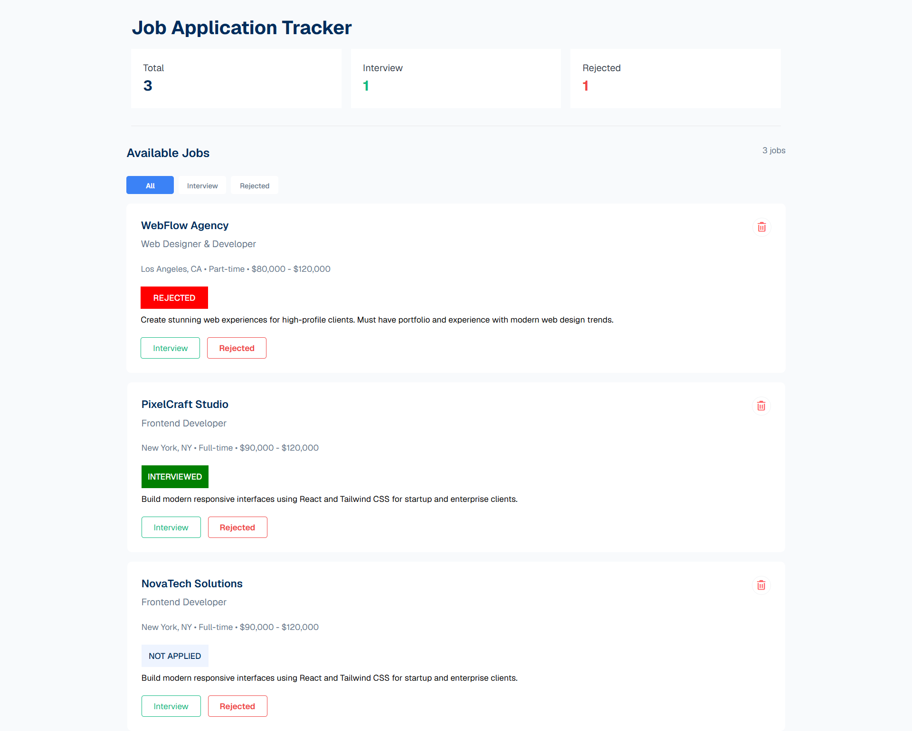
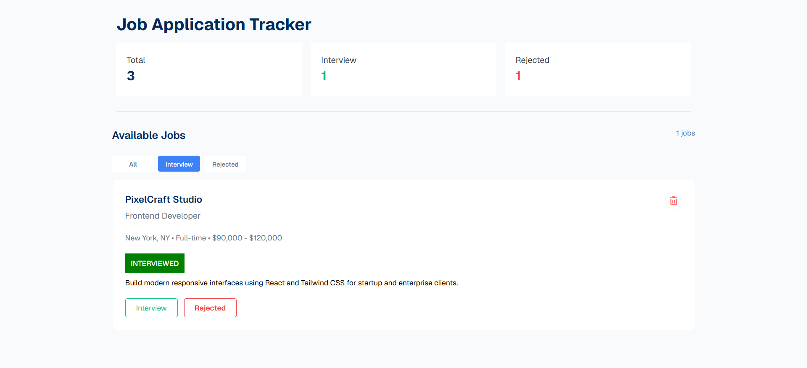
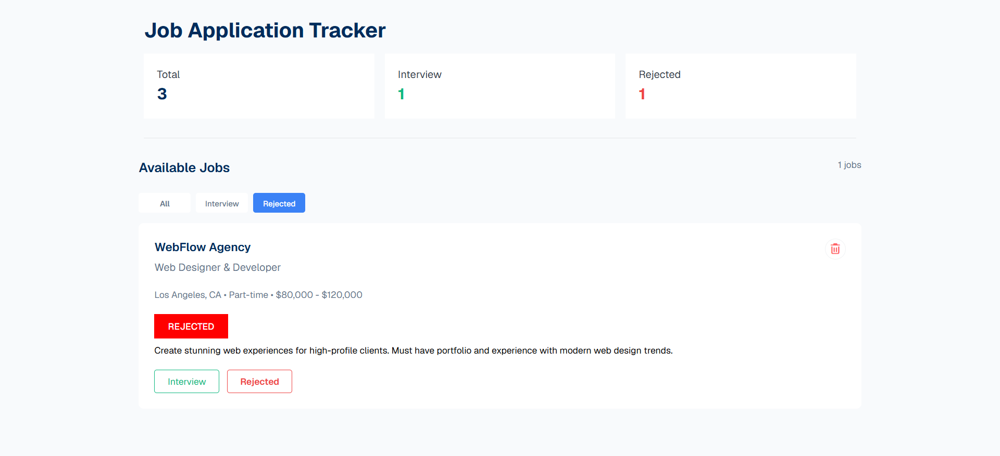
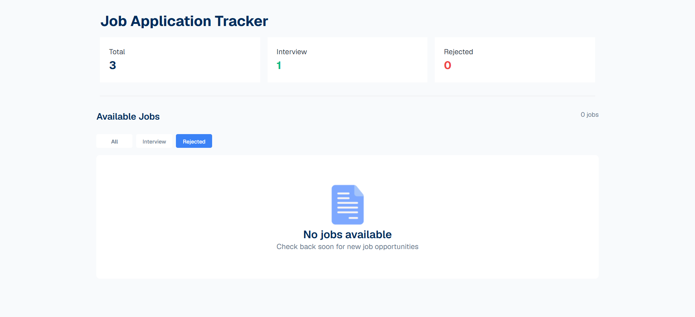

# Project Name: Job Tracker

```Live link``` (https://raihan-10.github.io/Web-Development/)

### Description:
A job tracking web application that help users to manage their job applications.

Track:
- Total applied job
- Interviewed
- Rejected

User also can remove jobs when they done interviewed or get rejected. 

---

## Features:

### Job Dashboard
- Total jobs
- Interview jobs count
- Rejected jobs count

---

### Job Cards
Each job cards contains:
- Comany Name
- Position
- Location, job-type, salary
- Interviewed or rejected
- Description

### Application status Tracking
user can update the job status and they can 
- Move job to interview section
- Move job to the rejected section

### Delete jobs
user can delete job from :
- Available job section
- Interview section
- Rejected section

## Preview
Dashboard

Interview Section

Rejected Section

Empty jobs when jobs are deleted


## Technology Used
- HTML
- CSS
- JavaScript

## Clone the repository
🚨 It will clone the entire repository. Just go inside the job tracker folder and then run 
`index.html`file.
```bash
git clone https://github.com/Raihan-10/Web-Development.git
```
